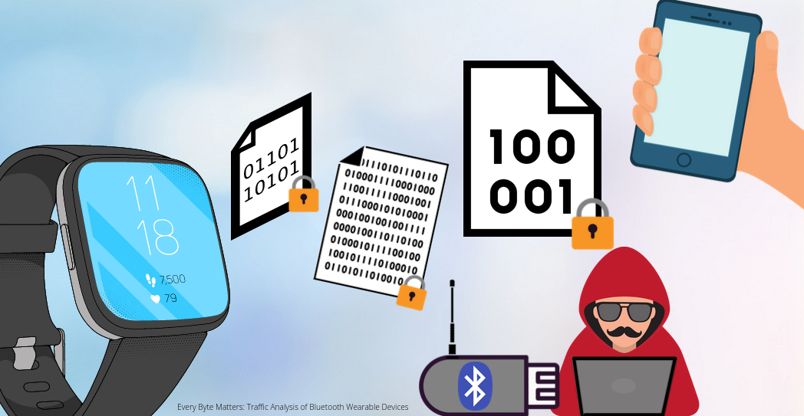
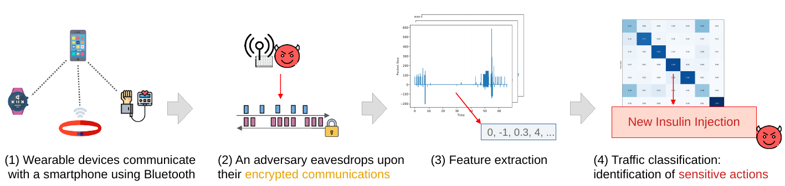

# Every Byte Matters: Traffic Analysis of Bluetooth Wearable Devices

This repository contains the code and the plots for the inference attack described in the paper **Every Byte Matters: Traffic Analysis of Wearable Devices** ([link to the paper](every_byte_matters_traffic_analysis_wearable_devices.pdf)).


Authors: [Ludovic Barman](https://people.epfl.ch/ludovic.barman), Alexandre Dumur, [Apostolos Pyrgelis](https://people.epfl.ch/apostolos.pyrgelis) and [Jean-Pierre Hubaux](https://people.epfl.ch/jean-pierre.hubaux)


To be presented at [Ubicomp 2021](https://www.ubicomp.org/ubicomp2021/), and published in [IMWUT 2021](https://dl.acm.org/doi/10.1145/3463512).

## Abstract

Wearable devices such as smartwatches, fitness trackers, and blood-pressure monitors process, store, and communicate sensitive and personal information related to the health, life-style, habits and interests of the wearer. This data is typically synchronized with a companion app running on a smartphone over a Bluetooth (Classic or Low Energy) connection. 

In this work, we investigate what can be inferred from the metadata (such as the packet timings and sizes) of encrypted Bluetooth communications between a wearable device and its connected smartphone. We show that a passive eavesdropper can use traffic-analysis attacks to accurately recognize (a) communicating devices, even without having access to the MAC address, (b) human actions (e.g., monitoring heart rate, exercising) performed on wearable devices ranging from fitness trackers to smartwatches, (c) the mere opening of specific applications on a Wear OS smartwatch (e.g., the opening of a medical app, which can immediately reveal a condition of the wearer), (d) fine-grained actions (e.g., recording an insulin injection) within a specific application that helps diabetic users to monitor their condition, and (e) the profile and habits of the wearer by continuously monitoring her traffic over an extended period.

We run traffic-analysis attacks by collecting a dataset of Bluetooth communications concerning a diverse set of wearable devices, by designing features based on packet sizes and timings, and by using machine learning to classify the encrypted traffic to actions performed by the wearer. Then, we explore standard defense strategies against traffic-analysis attacks such as padding, delaying packets, or injecting dummy traffic. We show that these defenses do not provide sufficient protection against our attacks and introduce significant costs. Overall, our research highlights the need to rethink how applications exchange sensitive information over Bluetooth, to minimize unnecessary data exchanges, and to research and design new defenses against traffic-analysis tailored to the wearable setting.  



_Teaser of the methodology: Traffic-analysis attack on the encrypted communications of Bluetooth wearable devices._

## How to Reproduce

Prerequisites: `python3` and `pip`. 

Step 1: We make the dataset available for research purposes; please contact us to obtain a copy. 

Step 2: `cd` to `inference_attack/`. Install the requirements via `pip install -r requirements.txt`

Step 3: Edit `constants.py` and point to the dataset directory (see Step 1). 

Step 4: Run one of the following files. The section numbering correspond to the sections in the paper.

- `device_id.py`: §5 device identification
- `chipset_id.py`: §5 chipset identification
- `action_id_wearables.py`: §6.1 "wide" experiment on action recognition, all wearable devices
- `app_id_huaweiwatch.py`: §6.2 "deep" experiment on WearOS, application-opening recognition
- `app_id_transfer.py`: §6.2.2 transfer experiment between different pairs of wearable devices
- `action_id_diabetesm.py`: §6.2.3 recognizing fine-grained actions within DiabetesM
- `longrun.py`: §6.2.4 long-term adversary
- `aging_training_{1,3}day.py`: §6.2.5 aging of the dataset
- `packet_loss_app_id_huaweiwatch.py`: §8 impact of packet loss

The output is provided on stdout and is generated in `plots/`.

### Details

Under the hood, each of the above files is organised in the same way:

- Initially, the dataset is parsed and cached. There are two levels of caching: a per-file caching (which simply cuts the .csv into [time,size]-events), and a global cache per attack/per file. Everything is cached into a folder `.cache`. Removing the cache folder triggers a deep-rebuild which includes the per-file caches (this should not be needed). Otherwise, there is a flag `REBUILD=True` to only rebuild the high-level cache file for the current attack (e.g., this is useful if the set of features or the cross-validation parameters changed). When in doubt, simply remove `.cache`.
- Then, each trace is mapped to the appropriate label + features via `build_features_labels_dataset()` 
- Finally, the scripts runs Random Forest with 10 fold cross validation, and creates plots. Each plot is saved with its data and the git commit of the dataset. Each output "plot" consist of the 5 files `PLOT_NAME.{py,json,tex,png,eps}`. The python script uses the `.json` to replots the `.{tex,png,eps}`.

### Figures names (in the paper) to file names

The sources for the figures are in `inference_attack/plots/`

- Fig 4a: `device-id-cla-cm`
- Fig 4b: `device-id-ble-cm`
- Fig 5a: `device-id-cla-fi`
- Fig 5b: `device-id-ble-fi`
- Fig 6a: `action-id-wearables-cm`
- Fig 6b: `action-id-wearables-fi`
- Fig 7a: `app-id-huaweiwatch-cm`
- Fig 7b: `app-id-huaweiwatch-fi`
- Fig 8a: `action-id-diabetesm-cm`
- Fig 8b: `action-id-diabetesm-fi`
- Fig 9: `longrun_p_r_f1_threshold`
- Fig 10a: `aging`
- Fig 10b: `aging_per_class`


## Acknowledgements

This work has been made possible by the help of Friederike Groschupp and Stéphanie Lebrun.
We also wish to thank Daniele Antonioli, Sylvain Chatel, Jiska Classen, Ricard Delgado, and David Lazar for the constructive discussions and feedbacks on the drafts.

We are grateful to the "Centre Suisse d'Electronique et Microtechnique" (CSEM) for providing us with the Ellisys Bluetooth sniffer.
This work was supported in part by grant 200021\_178978/1 (PrivateLife) of the Swiss National Science Foundation (SNF).

Some illustrations in the paper have been made by the artists freepik, eucalyp and smashicons ([flaticon.com](https://flaticon.com)).

## How to cite

ACM:
```
Ludovic Barman, Alexandre Dumur, Apostolos Pyrgelis, and Jean-Pierre Hubaux. 2021. Every Byte Matters: Traffic Analysis of Bluetooth Wearable Devices. Proc. ACM Interact. Mob. Wearable Ubiquitous Technol. 5, 2, Article 54 (June 2021), 45 pages. DOI:https://doi.org/10.1145/3463512
```

Bibtex:
```
@article{10.1145/3463512,
	author = {Barman, Ludovic and Dumur, Alexandre and Pyrgelis, Apostolos and Hubaux, Jean-Pierre},
	title = {Every Byte Matters: Traffic Analysis of Bluetooth Wearable Devices},
	year = {2021},
	issue_date = {June 2021},
	publisher = {Association for Computing Machinery},
	address = {New York, NY, USA},
	volume = {5},
	number = {2},
	url = {https://doi.org/10.1145/3463512},
	doi = {10.1145/3463512},
	journal = {Proc. ACM Interact. Mob. Wearable Ubiquitous Technol.},
	month = jun,
	articleno = {54},
	numpages = {45},
	keywords = {wearables, Bluetooth, traffic-analysis, metadata}
}
```

## Misc

Maintainer of this repository: Ludovic Barman.